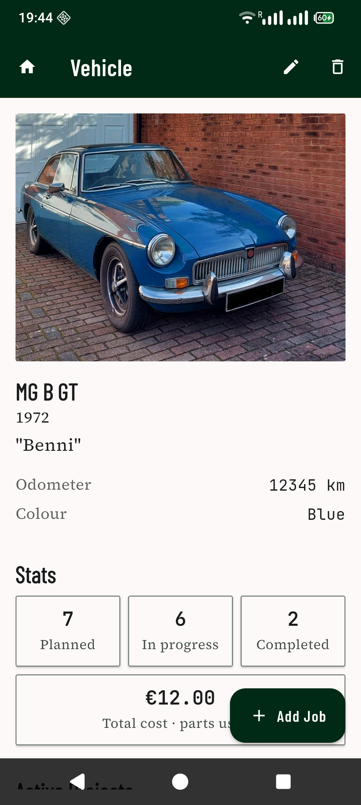
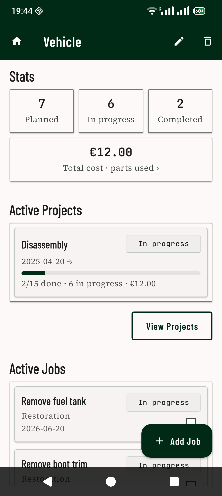
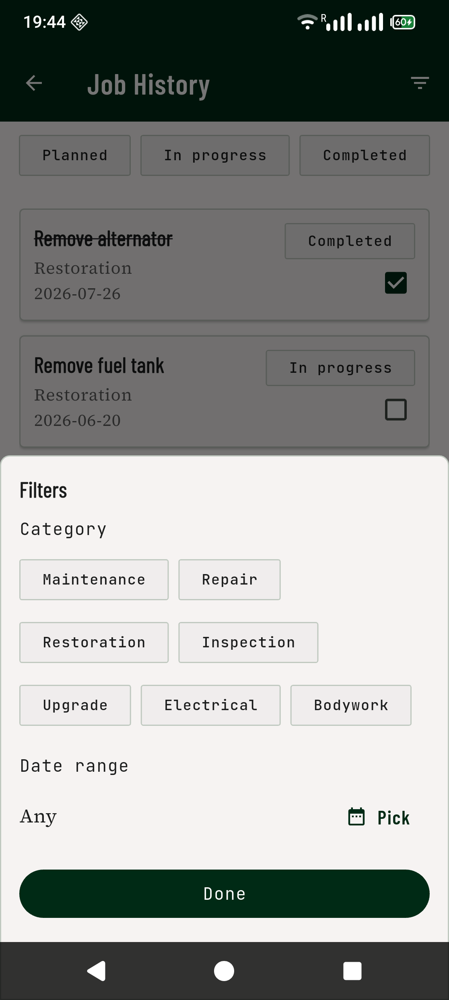

# Tala

Tala is a car-maintenance logbook for people who want a calm, durable record of the work they put into their vehicles. Add a car, log each job (oil change, brake pads, timing belt, MOT…), attach photos and documents, and keep the history in one place. The design language — *Heritage Workshop* — draws from mid-century automotive manuals and restoration garages: warm paper surfaces, ink-weight typography, and JetBrains Mono for the spec fields you'd expect on a workshop ledger.

The app is **local-first**: everything lives on your device in a SQLite database. There is no network layer — a future sync path to a self-hosted backend is designed for but not built (see [`BACKLOG.md`](BACKLOG.md)).

<p align="center">
  
  
  
</p>

---

## Features

- Add, edit, and delete vehicles (make, model, year, plate, cover photo).
- Log jobs against a vehicle with title, notes, date, mileage, and cost; group them into projects; and track the parts used.
- Attach photos **and files** (receipts, PDF manuals) to a vehicle, project, job, or part — each with a caption. Images open full-screen; documents open in whatever app you have.
- Filter the job history by status, category, and date.
- Back up and restore everything (database + files) as a single ZIP via the OS share sheet.
- All data stays on the device. No account, sign-in, or network connection is needed — the app opens straight to your garage.

## Status

Tala is a **personal project**, not a published app — it isn't on the Play Store or any other store, and there's no hosted build to download. To run it, build and install it yourself (see [Getting started](#getting-started)). Android is the primary target; iOS, web, and desktop builds exist via Flutter but aren't actively tested.

---

## Getting started

### Prerequisites

- Flutter SDK matching `environment.sdk: ^3.9.0` in `pubspec.yaml`.
- **Android builds use Java 21.** The Android toolchain is AGP 9.2.0 + Kotlin 2.2.20 + Gradle 9.4.1. Point Gradle at a Java 21 install via `android/local.properties` (gitignored):
  ```properties
  org.gradle.java.home=/usr/lib/jvm/java-21-openjdk
  ```
  On Arch Linux: `sudo pacman -S jdk21-openjdk`.

### Setup & run

```bash
flutter pub get     # install dependencies
flutter run         # run on a connected device or emulator
```

There are no compile-time defines or network configuration to set — the app runs fully offline against the local database.

### Install on your phone

To keep a copy on your device (rather than a hot-reload session):

```bash
flutter install --release          # build and install to a connected device
# or build the APK and transfer/sideload it yourself:
flutter build apk --release        # → build/app/outputs/flutter-apk/app-release.apk
```

Release builds are signed with the keystore in `android/key.properties` if present, and fall back to debug signing otherwise — fine for personal sideloading.

### Database codegen

The schema lives in `lib/data/database/app_database.dart` and is managed by Drift. After any table or column change, regenerate the `.g.dart` file:

```bash
dart run build_runner build --delete-conflicting-outputs
```

### Quality checks

```bash
flutter test                                # all tests
flutter test test/path/to/file_test.dart    # single file
flutter analyze                             # lint
dart format lib/                            # format
```

---

## Architecture at a glance

- **Domain** (`lib/domain/models/`) — plain Dart models (`Vehicle`, `Job`, `Project`, `Part`, `JobPart`, `Attachment`) with `toDrift()` / `fromDrift()` helpers, plus enums for the closed sets (`ProgressStatus`, `AttachmentType`).
- **Data** (`lib/data/`) — Drift database and local SQLite-backed repositories; every method returns `Result<T>` with typed errors (`AppException`).
- **UI** (`lib/ui/`) — feature folders (`home/`, `vehicle/`, `job/`, `project/`, `part/`, `backup/`, `core/`) each with `view_models/` (ChangeNotifier + Command) and `widgets/`.
- **Routing** — `go_router` in `lib/routing/`. Initial location is the home screen; Tala is single-user and local, with no sign-in.
- **Key patterns** — `Result<T>` sealed class for repository returns, `Command<T>` for async UI actions, `Provider` for DI.
- **Testing** — ViewModel and widget tests use in-memory fakes (`test/helpers/`) and don't touch SQLite; repository and migration tests run against a real in-memory SQLite (`AppDatabase.forTesting` + `NativeDatabase.memory()`, in `test/data/`).

For deeper context see:

- [`CLAUDE.md`](CLAUDE.md) — architecture, layering, patterns, and conventions.
- [`DESIGN.md`](DESIGN.md) — product/UX direction.
- [`tala_design_core.md`](tala_design_core.md) — theme source of truth (colors, typography, spacing).
- [`BACKLOG.md`](BACKLOG.md) — pending work.

## Key dependencies

- State & routing: [`provider`](https://pub.dev/packages/provider), [`go_router`](https://pub.dev/packages/go_router)
- Database: [`drift`](https://pub.dev/packages/drift), [`sqlite3_flutter_libs`](https://pub.dev/packages/sqlite3_flutter_libs), [`path_provider`](https://pub.dev/packages/path_provider), [`path`](https://pub.dev/packages/path)
- Photos: [`image_picker`](https://pub.dev/packages/image_picker), [`flutter_image_compress`](https://pub.dev/packages/flutter_image_compress), [`photo_view`](https://pub.dev/packages/photo_view)
- Backup: [`archive`](https://pub.dev/packages/archive), [`share_plus`](https://pub.dev/packages/share_plus), [`file_selector`](https://pub.dev/packages/file_selector)
- Prefs & misc: [`shared_preferences`](https://pub.dev/packages/shared_preferences), [`uuid`](https://pub.dev/packages/uuid), [`google_fonts`](https://pub.dev/packages/google_fonts), [`logging`](https://pub.dev/packages/logging)

## License

Released under the [MIT License](LICENSE).
